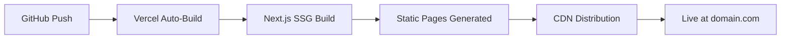

# EMEA Global Services — Website Implementation Plan

## Goal
Build a premium, modern website for **EMEA Global Services** (mechanical engineering & industrial automation for Oil & Gas sectors), inspired by the [Orbai Framer template](https://orbai-template.framer.website/). The site will be hosted on **Vercel** and feature a dark-themed, animation-rich design with full mobile responsiveness.

---

## User Review Required

> [!IMPORTANT]
> **Content & Branding Decisions Needed** — The following items need your input before I begin:

1. **Contact Email** — What email address should be displayed? (e.g., `enquiries@emeaglobal.com`)
2. **Phone Number** — Should a phone number be displayed? If so, what is it?
3. **Office Locations** — The doc mentions US, EMEA (UK, Germany, France, Middle East), Australia. Should all 4 regions show on the contact page? Any specific addresses?
4. **Team Members** — Do you want a "Team" section? If yes, provide names, roles, and photos (or should I use placeholder silhouettes?)
5. **Company Stats** — What numbers should I use? (e.g., "150+ Projects", "25+ Years", "50+ Engineers", "4 Global Offices")
6. **Client Logos / Testimonials** — Do you have any client testimonials or partner logos to include?
7. **Pricing Section** — The reference has pricing plans. Do you want this for EMEA, or should I replace it with an "Engagement Models" section (e.g., Staff Augmentation, Managed Services, Project-Based)?
8. **Domain Name** — What will the production domain be? (for SEO meta tags)
9. **Logo** — I see the EM logo image you shared. Is there also a full "EMEA Global Services" wordmark, or should I create the text treatment alongside the EM icon?
10. **Color Preference** — The logo uses dark navy blue (#0A2472) and a teal/cyan arc (#5CC8D7). Should I use these as the primary brand colors?

---

## Open Questions

> [!WARNING]
> **Service Page Depth** — Your documents describe **25+ individual services** across 4 divisions. Two options:
> - **Option A (Recommended)**: Create individual detail pages for each service (25+ pages). This is great for SEO but requires more build time.
> - **Option B**: Group services into 4 division pages with expandable sections for each service.
> 
> Which approach do you prefer?

> [!IMPORTANT]
> **Form Backend** — For the Contact Us form, do you want:
> - **Option 1**: Formspree or similar free form backend (no server needed)
> - **Option 2**: Email.js integration (sends directly from browser)
> - **Option 3**: A Vercel serverless function that sends emails via SMTP
> Which do you prefer?

---

## Architecture & Tech Stack

| Layer | Technology | Rationale |
|-------|-----------|-----------|
| Framework | **Next.js 14** (App Router) | SEO-friendly SSG, Vercel-native, file-based routing |
| Styling | **Vanilla CSS** with CSS custom properties | Maximum control over Orbai-style animations |
| Animations | **Intersection Observer API** + CSS transitions | Scroll-triggered reveals matching Orbai reference |
| Smooth Scroll | **Lenis** library | Butter-smooth scrolling (you've used this before on Adveris) |
| Font | **Inter** (Google Fonts) | Clean, modern, professional |
| Icons | **Lucide React** | Lightweight, consistent icon set |
| Deployment | **Vercel** | Zero-config Next.js hosting, automatic CI/CD |
| Forms | TBD (see open question above) | Contact form submission |

---

## Site Map & Page Structure

```mermaid
graph TD
    A["🏠 Home Page"] --> B["📋 Services"]
    A --> C["🏢 About Us"]
    A --> D["📞 Contact Us"]
    A --> E["🔒 Privacy Policy"]
    
    B --> F["Engineering & Design"]
    B --> G["Manufacturing & Industrialization"]
    B --> H["Digital & Industry 4.0"]
    B --> I["Consulting & Transformation"]
    
    F --> F1["Product Engineering"]
    F --> F2["NPD & Prototyping"]
    F --> F3["Reverse Engineering"]
    F --> F4["Value Engineering"]
    F --> F5["Process Engineering & FEED"]
    F --> F6["Skid & Modular Systems"]
    F --> F7["FEA / CFD Simulation"]
    F --> F8["CAD & PLM Services"]
    F --> F9["O&G Downstream Support"]
    
    G --> G1["Tooling & Fixture Engineering"]
    G --> G2["Special Purpose Machines"]
    G --> G3["Assembly Automation"]
    G --> G4["Production Engineering"]
    G --> G5["Industrial Engineering & Lean"]
    
    H --> H1["Digital Twin Development"]
    H --> H2["PLC / SCADA / IIoT"]
    H --> H3["Robotics & Automation"]
    H --> H4["Data & AI Systems"]
    H --> H5["Predictive Maintenance"]
    H --> H6["Computer Vision & Inspection"]
    
    I --> I1["Engineering Consulting"]
    I --> I2["Plant Modernisation"]
    I --> I3["Digital Transformation"]
    I --> I4["Optimization & Value Engineering"]
```



---

## Homepage Sections (Matching Orbai Layout)

The homepage will have **12 sections**, each with scroll-triggered animations:

| # | Section | Orbai Equivalent | EMEA Content |
|---|---------|-----------------|--------------|
| 1 | **Hero** | Hero with tagline + CTA | "Engineering Excellence for the Industrial World" + Get Started / View Services buttons |
| 2 | **Marquee / Ticker** | Scrolling benefits bar | Rolling keywords: Faster Innovation · Scalable Solutions · Cost Effective · Real-Time Insights · Automation · Data-Driven |
| 3 | **Why Choose Us** | Benefits cards (3 cards) | Global Reach · Domain Expertise · End-to-End Delivery + animated metrics |
| 4 | **Features** | 4 feature cards with icons | 4 core capabilities: Engineering Design, Manufacturing, Digital Industry 4.0, Consulting |
| 5 | **Services** | Service cards with interactive elements | 4 division cards with hover effects linking to service pages |
| 6 | **Process** | 3-step process (01, 02, 03) | Discovery & Assessment → Design & Engineering → Deploy & Support |
| 7 | **Projects / Case Studies** | Tab-based project showcase | 3 industry case studies (Oil & Gas,  Manufacturing) |
| 8 | **Stats Counter** | Statistics row | 150+ Projects · 98% Client Satisfaction · 25+ Years · 4 Global Offices |
| 9 | **Testimonials** | Client quotes carousel | 3-4 client testimonials |
| 10 | **Comparison** | Us vs Others table | EMEA vs Traditional Engineering Firms |
| 11 | **FAQ** | Accordion FAQ | 5-6 industry-relevant questions |
| 12 | **CTA + Footer** | Final CTA + footer links | "Ready to Transform?" CTA + full footer |

---

## Design System (Matching Orbai Aesthetic)

### Color Palette
```
--bg-primary:       #0A0A0F;       /* Near-black background */
--bg-secondary:     #111118;       /* Slightly lighter dark */
--bg-card:          #16161E;       /* Card backgrounds */
--bg-card-hover:    #1C1C26;       /* Card hover state */

--brand-primary:    #0A2472;       /* EMEA Navy Blue (from logo) */
--brand-accent:     #5CC8D7;       /* EMEA Teal/Cyan (from logo arc) */
--brand-gradient:   linear-gradient(135deg, #0A2472, #5CC8D7);

--text-primary:     #FFFFFF;       /* White headings */
--text-secondary:   #A0A0B0;       /* Muted body text */
--text-muted:       #6B6B7B;       /* Labels, captions */

--border-subtle:    rgba(255,255,255,0.06);  /* Card borders */
--border-hover:     rgba(92,200,215,0.3);    /* Hover borders */

--division-engineering:    #2E6FBF;  /* Blue - Division 01 */
--division-manufacturing:  #0F9B7D;  /* Teal - Division 02 */
--division-digital:        #7C5CFC;  /* Purple - Division 03 */
--division-consulting:     #F59E0B;  /* Amber - Division 04 */
```

### Typography
```
--font-primary:     'Inter', sans-serif;
--font-heading:     700 (bold);
--font-body:        400 (regular);

/* Sizes */
--text-hero:        clamp(2.5rem, 5vw, 4.5rem);
--text-h2:          clamp(1.8rem, 3vw, 3rem);
--text-h3:          clamp(1.2rem, 2vw, 1.5rem);
--text-body:        1rem;
--text-small:       0.875rem;
--text-label:       0.75rem;  /* Uppercase section labels */
```

### Animation System (Matching Orbai)
| Animation | CSS Implementation | Trigger |
|-----------|-------------------|---------|
| **Fade-up** | `translateY(30px) → translateY(0)` + opacity | Scroll into view |
| **Stagger** | Each child has `transition-delay: calc(var(--i) * 0.1s)` | Scroll into view |
| **Scale-in** | `scale(0.95) → scale(1)` + opacity | Scroll into view |
| **Marquee** | CSS `@keyframes` horizontal scroll | Continuous |
| **Card hover** | `translateY(-4px)` + border-color change + subtle glow | Mouse hover |
| **Button hover** | Background gradient shift + scale(1.02) | Mouse hover |
| **Counter** | JS number increment from 0 → target | Scroll into view |
| **Accordion** | `max-height: 0 → auto` with transition | Click |
| **Nav blur** | `backdrop-filter: blur(20px)` on scroll | Window scroll |

### Card Component Styles
```css
/* Orbai-style cards */
.card {
    background: rgba(22, 22, 30, 0.6);
    border: 1px solid rgba(255, 255, 255, 0.06);
    border-radius: 16px;
    padding: 2rem;
    backdrop-filter: blur(10px);
    transition: all 0.3s cubic-bezier(0.4, 0, 0.2, 1);
}
.card:hover {
    border-color: rgba(92, 200, 215, 0.3);
    transform: translateY(-4px);
    box-shadow: 0 8px 32px rgba(92, 200, 215, 0.1);
}
```

---

## Proposed File Structure

```
c:\Users\HP\Documents\emea\
├── public/
│   ├── images/
│   │   ├── logo.svg                    # EMEA logo
│   │   ├── hero-bg.webp                # Generated hero background
│   │   ├── og-image.jpg                # Social sharing image
│   │   └── services/                   # Service category images
│   └── favicon.ico
├── src/
│   ├── app/
│   │   ├── layout.js                   # Root layout (nav + footer)
│   │   ├── page.js                     # Homepage (12 sections)
│   │   ├── globals.css                 # Global styles + design tokens
│   │   ├── about/
│   │   │   └── page.js                 # About Us page
│   │   ├── contact/
│   │   │   └── page.js                 # Contact page + form
│   │   ├── services/
│   │   │   ├── page.js                 # Services overview (all 4 divisions)
│   │   │   ├── engineering/
│   │   │   │   ├── page.js             # Engineering division overview
│   │   │   │   ├── product-engineering/page.js
│   │   │   │   ├── npd-prototyping/page.js
│   │   │   │   ├── reverse-engineering/page.js
│   │   │   │   ├── value-engineering/page.js
│   │   │   │   ├── process-engineering/page.js
│   │   │   │   ├── skid-modular-systems/page.js
│   │   │   │   ├── fea-cfd-simulation/page.js
│   │   │   │   ├── cad-plm-services/page.js
│   │   │   │   └── oil-gas-downstream/page.js
│   │   │   ├── manufacturing/
│   │   │   │   ├── page.js
│   │   │   │   ├── tooling-fixture/page.js
│   │   │   │   ├── special-purpose-machines/page.js
│   │   │   │   ├── assembly-automation/page.js
│   │   │   │   ├── production-engineering/page.js
│   │   │   │   └── industrial-engineering-lean/page.js
│   │   │   ├── digital/
│   │   │   │   ├── page.js
│   │   │   │   ├── digital-twin/page.js
│   │   │   │   ├── plc-scada-iiot/page.js
│   │   │   │   ├── robotics-automation/page.js
│   │   │   │   ├── data-ai-systems/page.js
│   │   │   │   ├── predictive-maintenance/page.js
│   │   │   │   └── computer-vision/page.js
│   │   │   └── consulting/
│   │   │       ├── page.js
│   │   │       ├── engineering-consulting/page.js
│   │   │       ├── plant-modernisation/page.js
│   │   │       ├── digital-transformation/page.js
│   │   │       └── optimization-value-engineering/page.js
│   │   └── privacy/
│   │       └── page.js
│   ├── components/
│   │   ├── Navbar.js                   # Sticky nav with blur
│   │   ├── Footer.js                   # Full-width footer
│   │   ├── Hero.js                     # Hero section
│   │   ├── Marquee.js                  # Scrolling ticker
│   │   ├── WhyChooseUs.js              # Benefits cards
│   │   ├── Features.js                 # Capabilities grid
│   │   ├── ServicesPreview.js           # Service division cards
│   │   ├── Process.js                  # 3-step process
│   │   ├── Projects.js                 # Case studies tabs
│   │   ├── Stats.js                    # Counter statistics
│   │   ├── Testimonials.js             # Client quotes
│   │   ├── Comparison.js               # Us vs Others
│   │   ├── FAQ.js                      # Accordion FAQ
│   │   ├── CTA.js                      # Final call-to-action
│   │   ├── ServicePageTemplate.js      # Reusable service detail layout
│   │   └── ScrollReveal.js             # Intersection Observer wrapper
│   ├── data/
│   │   ├── services.js                 # All service data (from your docs)
│   │   └── siteConfig.js               # Site-wide configuration
│   └── hooks/
│       ├── useScrollReveal.js          # Scroll animation hook
│       └── useCountUp.js              # Number counter hook
├── next.config.js
├── package.json
└── vercel.json
```

---

## Page Details

### 🏠 Home Page (`/`)
Full-width, section-based layout with 12 scroll-animated sections as detailed above. Each section triggers a `fade-up` animation on scroll. Sticky navbar with blur background.

### 🏢 About Us (`/about`)
- Hero banner: "About EMEA Global Services"
- Company story / mission / vision
- Global presence map (US, EMEA, UK, Australia)
- Values section (Precision, Innovation, Partnership, Safety)
- Team section (if provided)
- Stats counter
- CTA: "Let's Work Together"

### 📋 Services Overview (`/services`)
- Hero: "Our Services" with description
- 4 division cards with hover effects, each linking to division pages
- Each division page lists its sub-services as cards
- Each sub-service page uses `ServicePageTemplate.js` with:
  - Header bar (division color)
  - Tagline
  - Introduction paragraph
  - Key Activities & Deliverables (2-column grid)
  - Typical Deliverables
  - Regions available
  - FAQ section (from SEO doc)
  - Related services sidebar
  - CTA to contact

### 📞 Contact (`/contact`)
- Two info cards: Email + Book a Call
- Contact form (Full Name, Email, Company, Subject, Message)
- FAQ accordion
- Google Maps embed (optional — needs addresses)

### 🔒 Privacy Policy (`/privacy`)
- Standard privacy policy page
- Styled consistently with rest of site

---

## Mobile Responsiveness Strategy

| Breakpoint | Target | Key Changes |
|-----------|--------|-------------|
| `≥1200px` | Desktop | Full grid layouts, hover animations |
| `768px – 1199px` | Tablet | 2-column grids → 1-column, reduced padding |
| `≤767px` | Mobile | Single column, hamburger nav, touch-optimized CTAs, reduced font sizes |

Key mobile adaptations:
- **Hamburger menu** with slide-in overlay
- **Touch-friendly** tap targets (min 44px)
- **Cards stack** vertically
- **Marquee** continues on mobile
- **FAQ accordion** works natively on touch
- **Stats counter** becomes 2x2 grid
- **Process steps** stack vertically with connecting line

---

## Vercel Deployment Plan



1. **Initialize** Next.js project in `c:\Users\HP\Documents\emea`
2. **Git init** and push to GitHub
3. **Connect** Vercel to GitHub repo
4. **Configure** custom domain (when ready)
5. **Automatic deployments** on every push

### `vercel.json` Configuration
```json
{
  "framework": "nextjs",
  "buildCommand": "next build",
  "outputDirectory": ".next"
}
```

---

## Build Phases

### Phase 1 — Foundation (This Session)
- [ ] Initialize Next.js project
- [ ] Set up design system (CSS custom properties, fonts)
- [ ] Build shared components (Navbar, Footer, ScrollReveal)
- [ ] Build complete Homepage with all 12 sections
- [ ] Generate hero background image

### Phase 2 — Core Pages
- [ ] About Us page
- [ ] Contact page with form
- [ ] Services overview page
- [ ] Privacy Policy page

### Phase 3 — Service Detail Pages
- [ ] Create `ServicePageTemplate` component
- [ ] Build all service data file from your docs
- [ ] Generate all 25 service detail pages
- [ ] Division overview pages (4)

### Phase 4 — Polish & Deploy
- [ ] Mobile responsiveness testing & fixes
- [ ] SEO meta tags for all pages
- [ ] Performance optimization (image optimization, lazy loading)
- [ ] Vercel deployment configuration
- [ ] Final review & adjustments

---

## Verification Plan

### Automated Tests
- `next build` — Ensures all pages compile without errors
- Lighthouse audit (aim for 90+ on all metrics)
- Mobile viewport testing at 375px, 768px, 1024px, 1440px

### Manual Verification
- Browser subagent to take screenshots at each breakpoint
- Scroll through all animations to verify smoothness
- Test all navigation links
- Test contact form submission
- Verify Vercel deployment

---

## Estimated Effort
| Phase | Estimated Time |
|-------|---------------|
| Phase 1 — Foundation + Homepage | ~60 min |
| Phase 2 — Core Pages | ~30 min |
| Phase 3 — Service Pages (templated) | ~30 min |
| Phase 4 — Polish + Deploy | ~20 min |
| **Total** | **~2.5 hours** |
